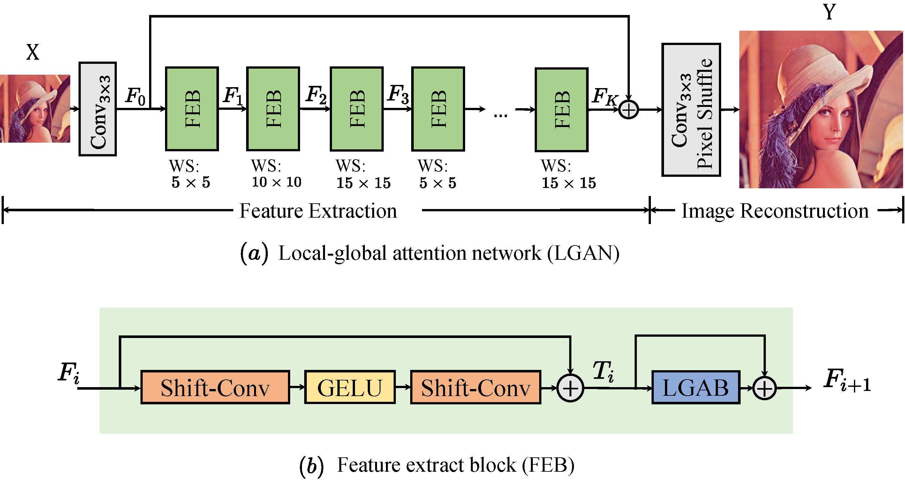
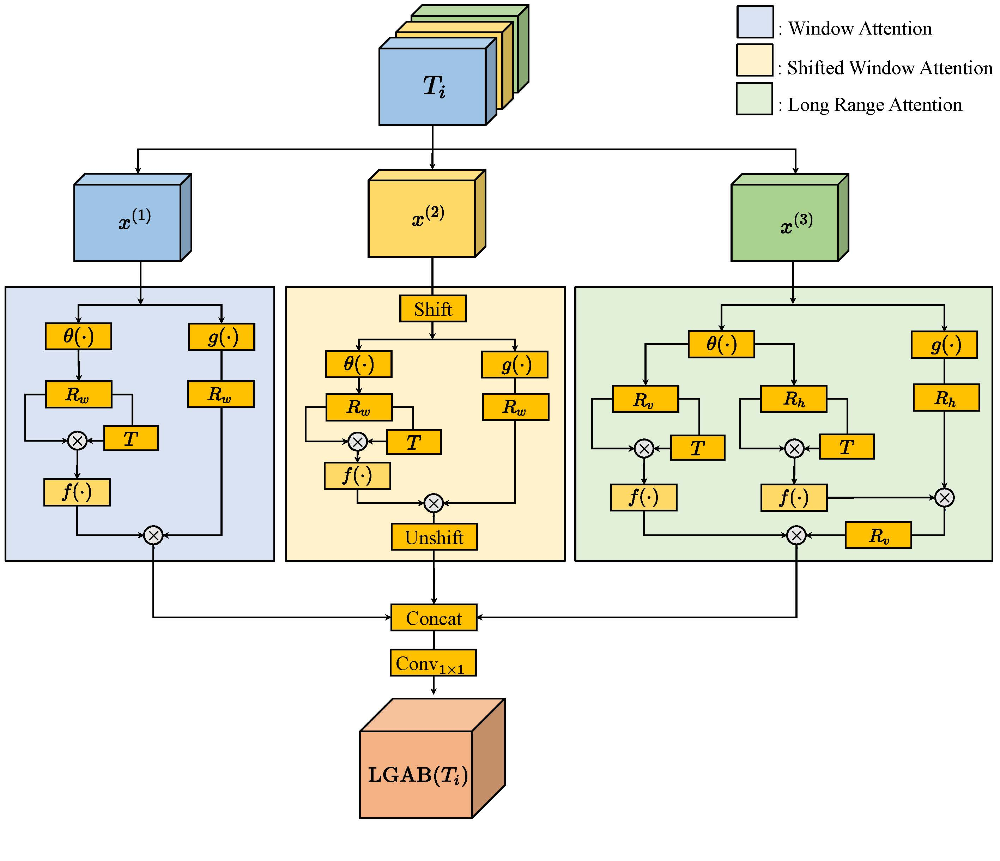
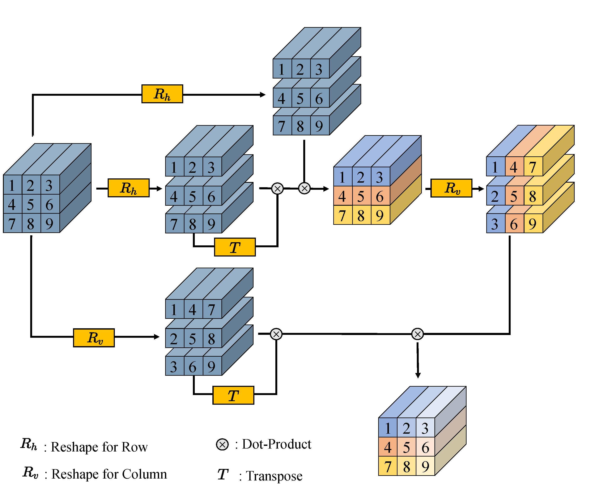
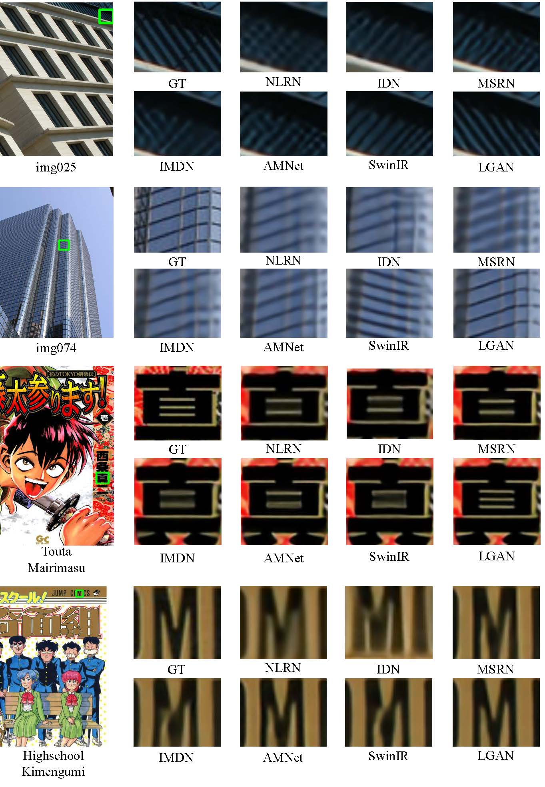
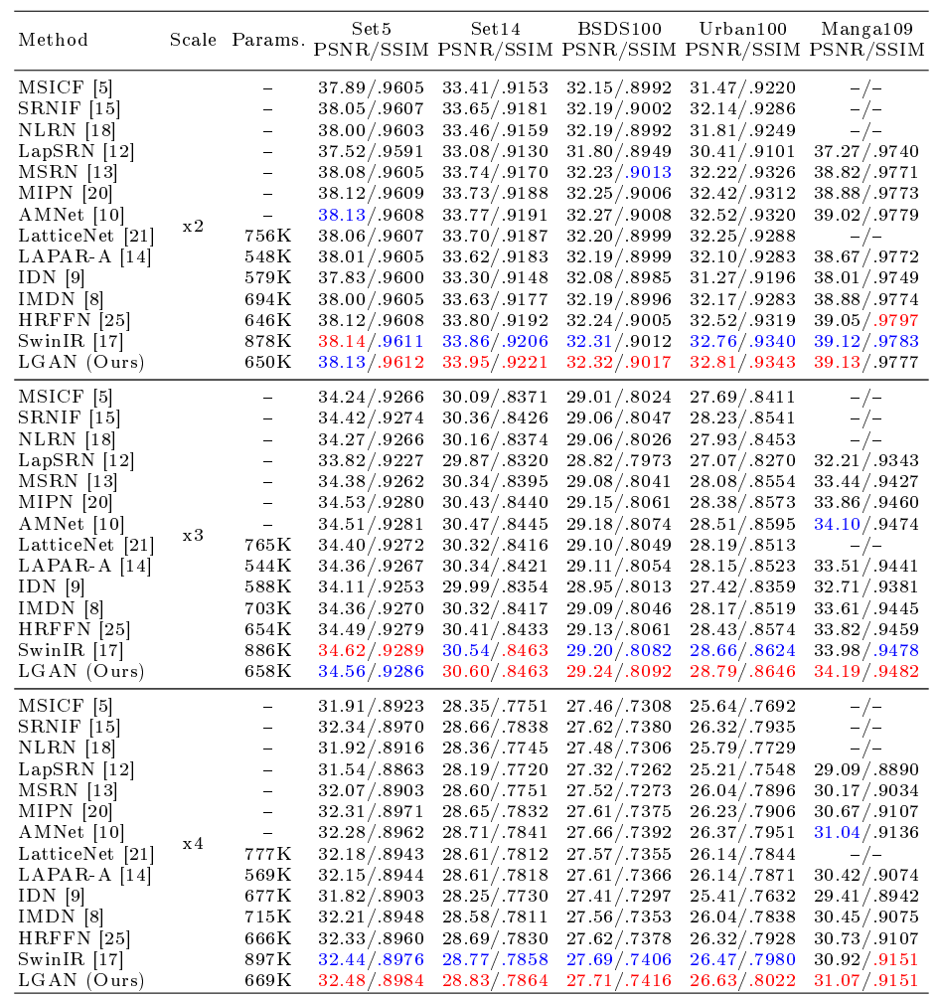

If you have any questions, please feel free to contact us.

email me at: zjsong@stu.suda.edu.cn 

or create a new issue directly.
# LGAN
## Information
Source codes for ["A Lightweight Local-Global Attention Network for Single Image Super-Resolution"](https://openaccess.thecvf.com/content/ACCV2022/papers/Song_A_Lightweight_Local-Global_Attention_Network_for_Single_Image_Super-Resolution_ACCV_2022_paper.pdf). It is accepted by [ACCV2022](https://accv2022.org/).
### The structure of LGAN is shown as follows:

### The structure of LGAB is shown as follows:

### How the feature maps reshaped is described in the figure:

### The visual comparison is shown as follows:

### Performance Evaluation:


Please check the [paper]() for more details.
# Steps
## Step 1: Install environment
The required environment is listed in 'env.yaml', please install the environment before training.

## Step 2: Edit config file
Settings can be edited in 'configs/config.yml'.

## Step 3: Prepare the dataset
You can download the dataset from [here](https://drive.google.com/file/d/1m4dZ1CARTohwu6tOznHtS-XjC4hnwCgm/view?usp=sharing).
``` 
|/SR_datasets
|-|/DIV2K
|-|-|/DIV2K_train_HR/
|-|-|/DIV2K_train_LR_bicubic/
|-|/benchmark
|-|-|/B100
|-|-|-|/HR
|-|-|-|/LR_bicubic
|-|-|/Manga109
|-|-|-|/HR
|-|-|-|/LR_bicubic
|-|-|/Set14
|-|-|-|/HR
|-|-|-|/LR_bicubic
|-|-|/Set5
|-|-|-|/HR
|-|-|-|/LR_bicubic
|-|-|/Urban100
|-|-|-|/HR
|-|-|-|/LR_bicubic
```

## Step 4: Train the network
Run
```
sh train.sh
```
or you can download pre-trained models
[x2](https://drive.google.com/file/d/1F3lasAWstsEVfaQefX1HiRAprOk5txvQ/view?usp=sharing)
[x3](https://drive.google.com/file/d/15GS6tapZC57Hr9OnBfJLcXvP8WkNACSz/view?usp=sharing)
[x4](https://drive.google.com/file/d/141eRsRVGYDe-zzxF_bzYi8IyZzNP9-fd/view?usp=sharing).

NOTE: PSNR and SSIM listed in paper is calculated by matlab program. The result calculated by Python program may be slightly inconsistent with the paper.
## Step 5: Evaluate the network
To evaluate the network, you should specify the parameter 'pretrain' in 'configs/config.yaml' first.
And run
```
sh test.sh
```
The visual result produced by LGAN can be obtained [here](https://drive.google.com/file/d/1WUxKDC3n07UIK0QFolREgTdwABwBWobU/view?usp=sharing).

# Thanks
The codes are implemented based on [ELAN](https://github.com/xindongzhang/ELAN).

